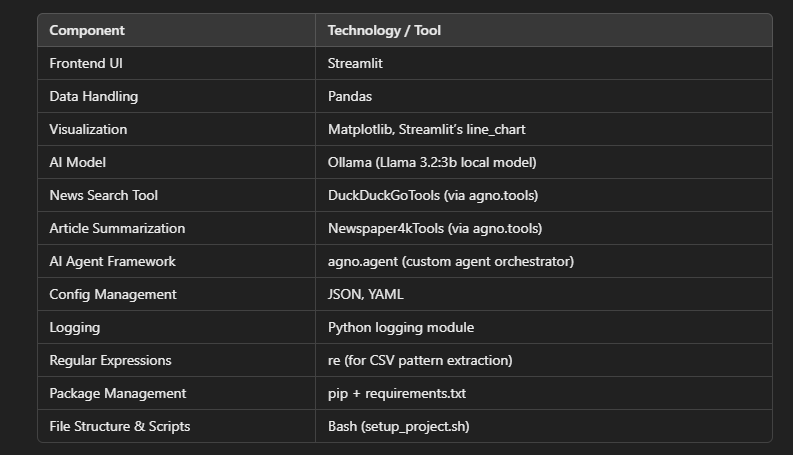
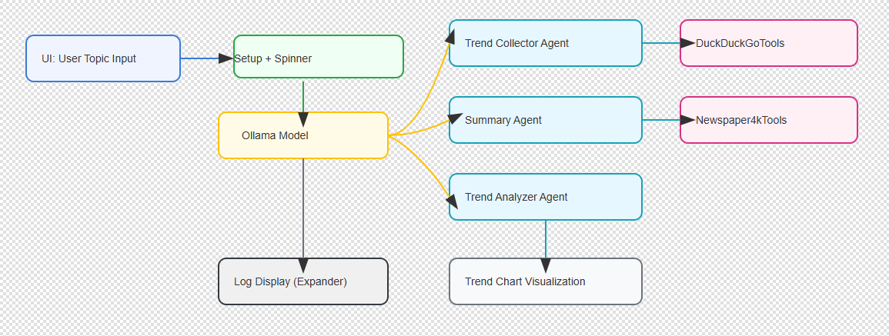

# Lets-Build-Growth-Opportunity-Analyzer-AI-Agent

A Practical Guide to Using AI Agents for Real-Time Market Opportunities & Strategic Business Decisions

## TL;DR
In this article, I’ll show how I built a simple AI agent system that helps businesses analyze opportunities from recent trends. I used AI models, automated trends scraping, summarization, and trend visualization — all wrapped in a clean UI. You’ll see how these tools can be practically applied to help any business make smarter, faster decisions.

## Introduction:
Getting started with AI in business doesn’t need to be overwhelming or complicated. I wanted to explore how a fictional business could make better, faster decisions by tapping into real-time trends, analyzing trends, and visualizing opportunities — powered entirely by AI agents.

So, I sat down and built a tool that does just that: you enter a business topic, and it gathers fresh news, summarizes it with sources, extracts insights, and even shows trends in a dynamic chart — all inside a web app. This wasn’t about creating something just for fun, but about showing how AI can actually be put to work in a useful, focused way.

## What’s This Article About?
In this post, I walk through the process of creating what I call the Business Opportunity Analyzer AI Agent. It’s an AI-powered tool that simulates how a company could gather recent business news on any topic — like fintech or renewable energy — summarize the important bits, identify emerging trends, and make that information digestible via visual charts.

I’ll explain how the tool uses local AI models (like Llama) along with news scraping tools. From setting up configurations to extracting CSV data for trend analysis, I break down each part so it’s easy to understand even if you’re just getting started with AI development

Full Article : [https://medium.com/@learn-simplified/how-i-built-business-opportunity-analyzer-ai-agent-80c0ee8c7b1c


## Tech Stack  




## Architecture




# Tutorial: How I Built Business Opportunity Analyzer AI Agent

## Prerequisites
- Python installed on your system.
- A basic understanding of virtual environments and command-line tools.

## Steps

1. **Virtual Environment Setup:**
   - Create a dedicated virtual environment for our project:
   
     ```bash
     python -m venv Lets-Build-Growth-Opportunity-Analyzer-AI-Agent
     ```
   - Activate the environment:
   
     - Windows:
       ```bash
          Lets-Build-Growth-Opportunity-Analyzer-AI-Agent\Scripts\activate        
       ```
     - Unix/macOS:
       ```bash
       source Lets-Build-Growth-Opportunity-Analyzer-AI-Agent/bin/activate
       ```
   

# Installation and Setup Guide

**Install Project Dependencies:**

Follow these steps to set up and run the  "How I Built Business Opportunity Analyzer AI Agent"

1. Navigate to your project directory:
   ```
   cd path/to/your/project
   ```
   This ensures you're in the correct location for the subsequent steps.

2. Install the required dependencies:
   ```
   pip install -r requirements.txt   
   ```
   This command installs all the necessary Python packages listed in the requirements.txt file.


# Run - Hands-On Guide: How I Built Business Opportunity Analyzer AI Agent
  
   ```
   streamlit run app.py   
   ```
   
## Closing Thoughts

Looking ahead, I believe AI tools like this will become a core part of every business strategy. We’re moving towards a future where companies will rely on AI not only to analyze data but to predict trends, recommend actions, and even automate strategic decisions. Tools like the one I built here are just the beginning. By learning how to build these now, we position ourselves to stay ahead in a world where AI will be at the heart of innovation and growth in business.